# 🌊 Wave Pool Weather

Wave Pool Weather is a lightweight weather analysis and forecasting website that predicts outdoor pool water temperatures across multiple US wave pool venues using a thermal energy balance model (WAVE-FEST) driven by live NWS and Open-Meteo forecast data.

## 🎯 Purpose

Outdoor pools respond to weather in complex ways — a hot windy day can actually cool a pool faster than a mild calm one. This site models that physics to give wave pool visitors a better sense of what water temperature to expect before they show up.

Built for wave pool fans and outdoor aquatic venues, the site:
- presents a visual dashboard for weather and pool forecasts,
- supports multiple pool locations across the US,
- stores data in SQLite for historical tracking,
- surfaces humidity, wind, and solar alongside temperature.

## 📍 Supported Locations

| Location | Lat | Lon | Pool Depth |
|---|---|---|---|
| Waco, Texas | 31.6212 | −97.0037 | 2.0 m |
| Palm Springs, California | 33.8303 | −116.5453 | 1.8 m |
| Lemoore, California | 36.3008 | −119.7829 | 2.0 m |
| Atlantic Park, Virginia Beach | 36.8529 | −75.9779 | 1.8 m |
| Oceanside, California | 33.1959 | −117.3795 | 1.5 m |

## 🔄 Forecast Pipeline

```mermaid
flowchart LR
    A([Start: pull_api_data.py]) --> B[Fetch NWS hourly forecast\nfor each location]
    B --> C[Aggregate hourly → daily means\nT_air, RH, wind speed & direction]
    C --> D[Fetch Open-Meteo solar irradiation\nshortwave_radiation_sum MJ m⁻² day⁻¹]
    D --> E[Write daily weather rows\nto air_temps table in SQLite]
    E --> F{Find initial pool\ntemperature seed}
    F -->|Plausible stored value\n4–40 °C found| G[Use most recent\npool_temps DB row]
    F -->|No stored value| H[Use today's\nair temperature]
    F -->|No air temp either| I[Default: 20 °C]
    G & H & I --> J[Pool thermal balance loop\none day per step]
    J --> K[Compute 5 heat flux terms\nQ_solar, Q_lw, Q_conv, Q_evap, Q_ground]
    K --> L[Forward Euler integration\nΔT = Q_total · Δt / ρd c_p]
    L --> M{More forecast\ndays?}
    M -->|Yes| J
    M -->|No| N[Write pool_temps rows\nto SQLite with heat_fluxes JSON]
    N --> O[Export forecast .txt files\nper location]
    O --> P[Generate dashboard.html\nwith Chart.js visualizations]
    P --> Q([Done])
```



## ⚛️ Physics Model

The pool is treated as a single well-mixed layer of water. Each day the temperature advances by one forward Euler step driven by five surface and bottom heat flux terms (all in W m⁻²; positive = heating the pool).

### 1 ☀️ — Absorbed Solar Radiation

$$
Q_{\text{solar}} = (1 - \alpha)\, G_s
$$

where $G_s$ (W m⁻²) is the mean daytime irradiance converted from the daily integral:

$$
G_s = \frac{H_s \times 10^6}{86400} \quad \left[\text{MJ m}^{-2}\text{day}^{-1} \to \text{W m}^{-2}\right]
$$

**Constants:** albedo $\alpha = 0.06$ (open water).

---

### 2 🌡️ — Net Longwave Radiation

$$
Q_{\text{lw,net}} = \varepsilon_{\text{sky}}\,\sigma\,T_{\text{air}}^4 - \varepsilon_{\text{water}}\,\sigma\,T_{\text{pool}}^4
$$

Sky emissivity is estimated from the Brutsaert (1975) formula using near-surface vapour pressure:

$$
\varepsilon_{\text{sky}} = 1.24 \left(\frac{e_a\,[\text{hPa}]}{T_{\text{air}}\,[\text{K}]}\right)^{1/7}
$$

where actual vapour pressure is $e_a = e_s(T_{\text{air}}) \times \text{RH}$ and saturation vapour pressure follows the Tetens formula:

$$
e_s(T) = 0.6108 \exp\!\left(\frac{17.27\,T}{T + 237.3}\right) \quad [\text{kPa}]
$$

**Constants:** Stefan-Boltzmann $\sigma = 5.67 \times 10^{-8}$ W m⁻² K⁻⁴, water emissivity $\varepsilon_{\text{water}} = 0.97$.

---

### 3 💨 — Sensible (Convective) Heat Flux

$$
Q_{\text{conv}} = h_c\,(T_{\text{air}} - T_{\text{pool}})
$$

$$
h_c = 5.7 + 3.8\,U \quad [\text{W m}^{-2}\text{K}^{-1}]
$$

where $U$ is wind speed in m s⁻¹. Correlation after McAdams (1954).

---

### 4 💧 — Evaporative Heat Flux

$$
Q_{\text{evap}} = -L_v \cdot \rho_a \cdot C_E \cdot U \cdot \frac{0.622}{P_{\text{atm}}} \cdot \bigl(e_s(T_{\text{pool}}) - e_a\bigr)
$$

Collecting constants into a single transfer coefficient:

$$
K_E = \frac{\rho_a\,C_E\,L_v\,\times 0.622}{P_{\text{atm}}} \approx 23.5 \quad [\text{W m}^{-2}(\text{m s}^{-1})^{-1}\text{kPa}^{-1}]
$$

$$
Q_{\text{evap}} = -K_E \cdot U \cdot \bigl(e_s(T_{\text{pool}}) - e_a\bigr)
$$

where $e_a = e_s(T_{\text{air}}) \times \text{RH}$. After Penman (1948) / Monteith open-water mass transfer.

---

### 5 🪨 — Conductive Ground Heat Flux

Heat exchange through the pool floor is modelled as a series thermal resistance — concrete slab over a soil column:

$$
R_{\text{total}} = \frac{L_c}{k_c} + \frac{d_{\text{soil}}}{k_{\text{soil}}}
\qquad
U_{\text{bottom}} = \frac{1}{R_{\text{total}}} \quad [\text{W m}^{-2}\text{K}^{-1}]
$$

$$
Q_{\text{ground}} = -U_{\text{bottom}}\,(T_{\text{pool}} - T_{\text{ground}})
$$

**Constants:** concrete slab thickness $L_c = 0.3048$ m (1 ft), concrete conductivity $k_c = 1.4$ W m⁻¹ K⁻¹.  
Soil conductivity $k_{\text{soil}}$ and undisturbed ground temperature $T_{\text{ground}}$ are set per location.

---

### 6 🔢 — Forward Euler Integration

$$
Q_{\text{total}} = Q_{\text{solar}} + Q_{\text{lw,net}} + Q_{\text{conv}} + Q_{\text{evap}} + Q_{\text{ground}}
$$

$$
\Delta T = \frac{Q_{\text{total}} \cdot \Delta t}{\rho_w \cdot d \cdot c_p}
\qquad
T_{\text{pool}}^{(t+1)} = T_{\text{pool}}^{(t)} + \Delta T
$$

| Symbol | Value | Units | Description |
|---|---|---|---|
| $\rho_w$ | 1000 | kg m⁻³ | Density of water |
| $c_p$ | 4186 | J kg⁻¹ K⁻¹ | Specific heat of water |
| $d$ | 1.5 – 2.0 | m | Effective pool depth (per location) |
| $\Delta t$ | 86400 | s | One-day time step |
| $L_v$ | 2.45 × 10⁶ | J kg⁻¹ | Latent heat of vaporisation |

---

## 🗂️ Repository Layout

```
scripts/pull_api_data.py     # Main data pipeline
scripts/validate_repo.py     # Lightweight repo health checker
tests/test_validate_repo.py  # Unit tests
data/wave_pool_weather.db    # SQLite database (not tracked)
data/forecasts/              # Exported per-location forecast text files
.github/workflows/           # CI and smoke-test GitHub Actions
dashboard.html               # Weather + pool dashboard
pool_temp_forecasts.html     # Per-location pool temperature forecast page
index.html                   # Site home
news.html                    # Wave pool news
about_contact.html           # About & contact
```

## 🚀 Getting Started

```bash
# Fetch latest weather data and regenerate all outputs
python3 scripts/pull_api_data.py

# Run the repo validator
python3 scripts/validate_repo.py

# Run unit tests
python3 -m unittest discover -s tests
```

Then open `dashboard.html` or `pool_temp_forecasts.html` in a browser.

Set `WAVE_POOL_TEST_MODE=1` to run the full pipeline in-memory with no file writes — useful for CI smoke tests.

Set `WAVE_POOL_FORCE_REFRESH=1` to bypass the same-day API cache and re-fetch all external data even when today's rows already exist in the database.  This is useful after a model-parameter change where you want fresh API data on the same calendar day.

## ⚙️ CI / CD

| Workflow | Trigger | Purpose |
|---|---|---|
| `ci.yml` | push / PR to `dev`, `main` | Repo validation + unit tests |
| `smoke-test.yml` | daily 10:15 UTC + manual | Full pipeline dry-run (`TEST_MODE=1`) |
| `auto-tag-main.yml` | push to `main` + manual | Create one annotated release tag and GitHub Release per new `main` commit |

`auto-tag-main.yml` creates tags in the existing date-based format (`YY.M.D`). If more than one commit lands on `main` in the same UTC day, the workflow appends a numeric suffix such as `26.5.23.1`. After tagging, it also creates or reuses a GitHub Release with auto-generated release notes and a three-word title derived from the merged PR title, or the push commit title if no PR is attached.

## 📚 References

- Brutsaert, W. (1975). On a derivable formula for long-wave radiation from clear skies. *Water Resources Research*, 11(5), 742–744.
- McAdams, W.H. (1954). *Heat Transmission*, 3rd ed. McGraw-Hill.
- Penman, H.L. (1948). Natural evaporation from open water, bare soil and grass. *Proc. R. Soc. London A*, 193, 120–145.
- Monteith, J.L. & Unsworth, M.H. (2008). *Principles of Environmental Physics*, 3rd ed. Academic Press.
